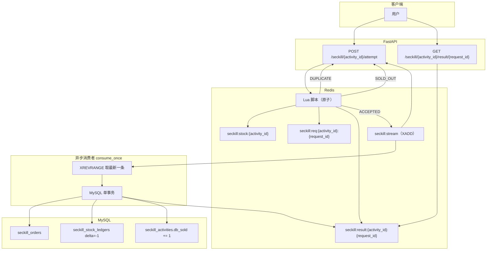
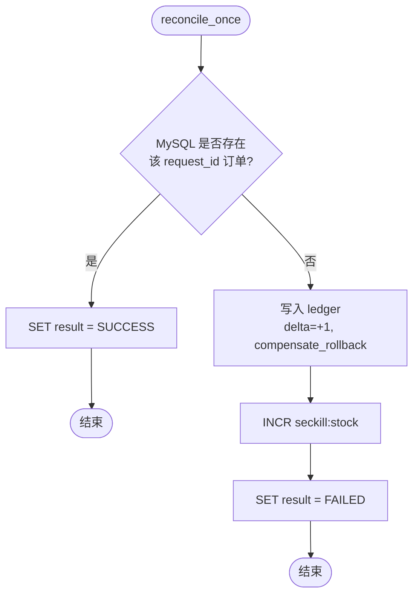

# 秒杀流程设计图（单活动单 SKU）

本文档描述当前工程内秒杀链路：**Redis Lua 预扣 → Redis Stream 异步落库 → MySQL 事务确认 → 可选补偿对账**。图中组件与 `src/orders/seckill/` 实现一致。

## 主流程（下单尝试与异步确认）

**说明：**

- **Lua** 在一次原子执行内完成：幂等键、库存判断与扣减、结果初始态（如 `PENDING`）。
- **ACCEPTED** 后向 `seckill:stream` **XADD** 事件；消费者用 **XREVRANGE** 处理最新事件，避免重复消费历史残留。
- 消费者事务成功后 **SET** `seckill:result:*` 为 **SUCCESS**（与代码中 TTL 策略一致）。

## 补偿流程（Redis 已扣、DB 无单）

当异步落库失败或需人工/定时对账时，调用 **`reconcile_once`**（见 `src/orders/seckill/compensation.py`）：

---

若需在 GitHub/GitLab 外预览 Mermaid，可使用支持 Mermaid 的 Markdown 预览或 [Mermaid Live Editor](https://mermaid.live)。
